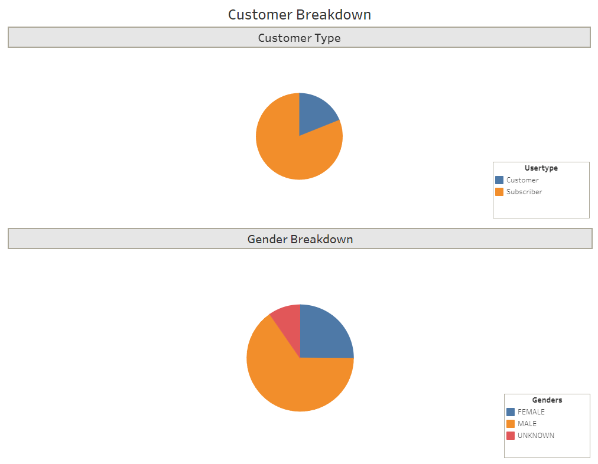
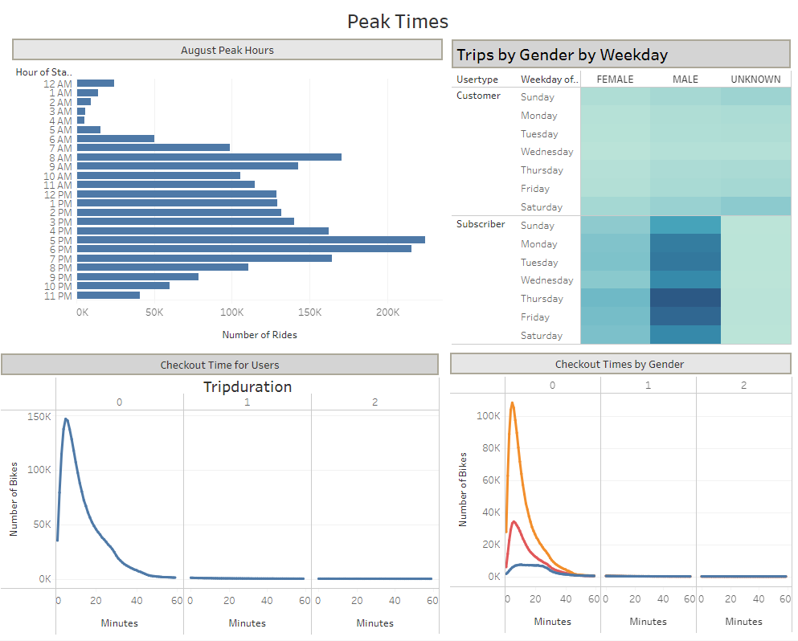
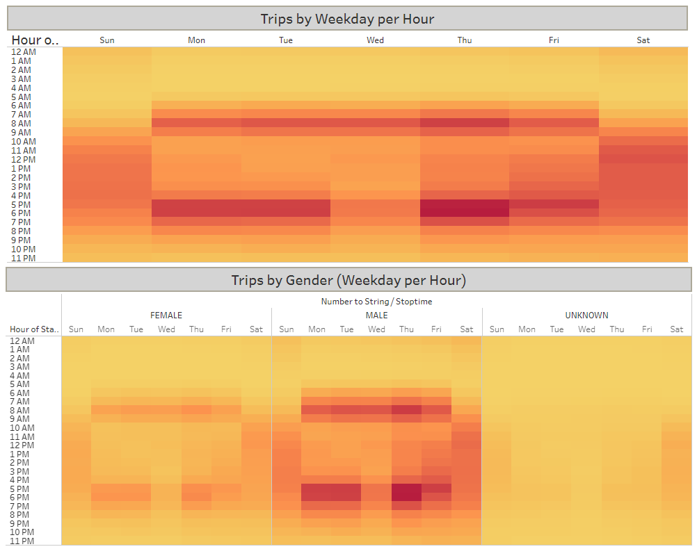

# bikesharing
An analysis of NYC CitiBike bikesharing data from August, 2019, with Tableau

## Overview
You may see the entirety of this Tableau story [at this link](https://public.tableau.com/views/NYCCitiBikeChallenge_16613098784890/NYCCitiBikeChallenge?:language=en-US&publish=yes&:display_count=n&:origin=viz_share_link).

In this project I used Tableau to present a business proposal for a bike sharing company. This analysis was conducted by using bikeshare data from CitiBike in New York City. A Presentation of this analysis will then be shown to investors looking to begin a bikeshare program in Des Moines, Iowa.

In this project I answer the following questions:

- Who uses bikeshare programs?
- What time of day are bikes used the most and the least?
- How much are the bikes used and by whom?

## Results
While the demographics of Des Moines may be different from that found in NYC, it can provide insight on who the target audicence would be for this new bikeshare company.
***

In the above image we can see that more than 3/4 of the users are **Subscribers**, who make regular use of the bikes and are a predictable source of income for the program. Bikeshare program users are also predominantly male, at approximately 5/8 to only about 1/4 female. The remaining 1/8 gender is unknown or undeclared.
***

This chart displays the number of bike rides initiated during each hour of the day, and check out times by gender. We can see peak usage during morning rush hour and end-of-workday commute times. What is also of note is the low-usage hours between 2 AM and 5 AM. These hours would be the best times to conduct **bike repairs** and **redistribution** of bikes from full stations to less-full stations.
***

A heatmap also helps show weekly usage patterns. Once again we can see the heavy bike usage during **weekday commute times**, and weekend usage is spread throughout the middle of the day.

## Summary
In conclusion, bikeshare services are remarkably popular in busy metropolitan areas. The user base is made up mostly of male subscribers, providing regular income to the program. More outreach should be done to attract female riders, but male users seem a reliable market. And main usage seems focused around morning and evening commute times.

If I were to pursue additional lines of inquiry for analysis and visualization, given the data provided, I would explore:
- trip starting and ending locations during morning and evening rush hour time-windows, to display the flow of traffic between neighborhoods at peak hours;
- average trip duration, by birth year, by gender, to explore if there was any difference in male or female or un-gendered riders as they age.